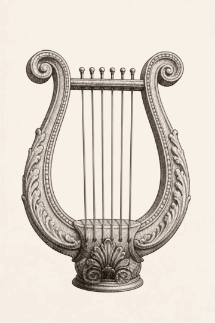
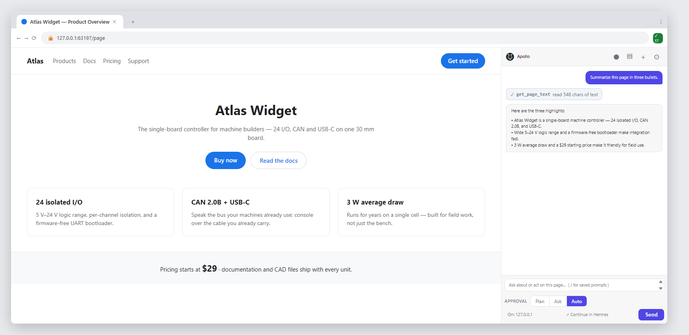
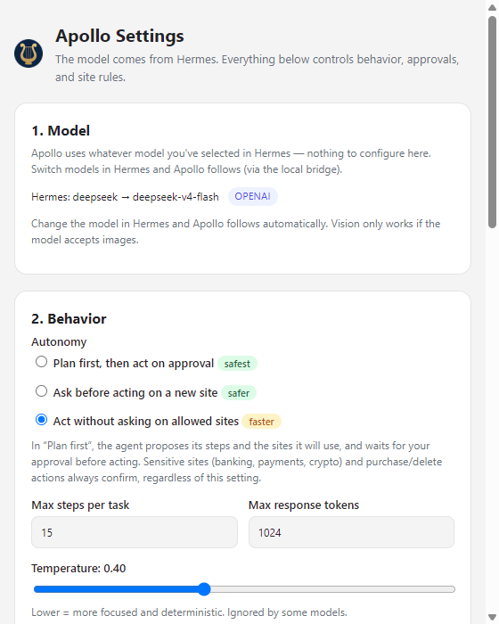

# Apollo — Hermes-Driven Browser Agent

> Apollo is the brother to [Hermes Agent](https://hermes-agent.nousresearch.com): an AI browser agent whose **hands live in your browser** and whose **brain is your Hermes agent**. In Greek myth, Apollo was Hermes' brother, most famous for his lyre (thus the icon).
> Fork of [OpenSidekick](https://github.com/esterhuizen/opensidekick).
>
> 

Apollo is a Chrome extension that turns your real, logged-in browser into an agent workspace. It keeps the best of OpenSidekick — a lean browser-agent loop with click/type/read tools, approval modes, and vision — and rebuilds the brain around **Hermes**, your personal agent:

- The **side panel** is a lean, fast browser agent whose model *follows whatever model you've selected in Hermes* — no API key ever stored in the browser (the ported key is held in service-worker memory only).
- **Hermes itself can drive the browser** from any session (desktop, Telegram, cron) through an MCP bridge, using the extension's 17 browser tools as its own hands.
- **Conversations survive closing the panel — and Chrome.** No more "Claude for Chrome loses context" problem.

## Screenshots

The panel beside the page — a real tool call (✓ `get_page_text`) and the answer, mid-run:



Settings → Model: nothing to configure. Apollo shows the model Hermes is supplying, and follows it automatically:



(`node scripts/screenshots.mjs` regenerates these — deterministic, no personal data. The relay port must be free when it runs.)

---

## Why this fork

OpenSidekick is an excellent single-machine agent, but three things didn't fit a Hermes-centric workflow:

1. **Context died with the panel.** Stock OpenSidekick stores the conversation in `chrome.storage.session`, which clears when Chrome closes. Apollo stores it in `chrome.storage.local` — it survives panel close *and* Chrome restarts.
2. **The model lived in the browser.** Keys and model choice were configured inside the extension, disconnected from the rest of your agent stack. Apollo ports Hermes's *active* model selection into the panel — change models in Hermes, and Apollo changes with you.
3. **No bridge to your own agent.** OpenSidekick is a standalone loop. Apollo adds a local relay (`127.0.0.1:8765`) that lets **Hermes call the browser's tools as MCP tools** — so Hermes can read pages, click, type, and navigate in your real logged-in sessions, not a headless shell.

## What Apollo gives Hermes

Hermes can already browse the web — but on its own it drives a *fresh, anonymous* automated browser, which means it hits logins, bot detection, and blank-slate sessions. Apollo hands Hermes **your real browser**:

- **Your logged-in sessions.** Hermes can work inside pages where "being you" is the point — Gmail, YouTube, CRM, any account already signed in — without you ever handing over credentials.
- **Whatever is already on screen.** A half-filled form, a tab left open, a page mid-scroll: Hermes reads it and acts in place, no re-navigation, no re-authentication.
- **Cross-tab work in your live session.** "Take X from that tab, then do Y with it in this one" — cookies, extensions, and site permissions intact.
- **Sites that break automation.** A real Chrome with real history looks human; a clean headless browser trips bot walls (and needs a backend installed). Apollo piggybacks on the Chrome you already run — zero setup.
- **Human-in-the-loop control.** Approval prompts and site rules live next to the work, in the browser you're already watching.

The boundary: Apollo adds the *browser-with-your-identity* surface. Plain text, APIs, and research outside the browser are already Hermes's own job.

## How Apollo differs from OpenSidekick

| | **OpenSidekick** (upstream) | **Apollo** (this fork) |
|---|---|---|
| Model selection | Picked in-extension (its own settings UI) | **Follows Hermes's active model** (ported over the local bridge) |
| Keys in browser | Stored in extension storage | **Never** — the relay supplies the key to the service worker on connect; it lives in **memory only** (never written to extension storage), or the message falls back through Hermes |
| Conversation storage | `chrome.storage.session` (clears on Chrome close) | `chrome.storage.local` (**survives close + restart**) |
| Claude / OAuth-only providers | Requires a raw API key in the browser | **Automatic bridge fallback** — panel messages route through Hermes (which owns the OAuth subscription); toast alerts the user |
| Hermes relationship | None | **Hermes drives the browser** via MCP (`mcp_apollo_*`, 17 tools) |
| Brain | Its own agent loop only | Lean loop for the panel **+** Hermes as the full agent brain |
| Identity | "OpenSidekick" | Apollo — Hermes-Driven Browser Agent |

### The model-following contract

Apollo reads Hermes's *default profile* config (`model.provider` / `model.default`) — the one you select in your Hermes chats — and maps it to the matching wire adapter:

| Hermes provider | Adapter | Direct? |
|---|---|---|
| `deepseek`, `gemini`, `openai`, `custom` (local) | OpenAI-compatible `openai` adapter | ✅ direct, fast (~1–8 s) |
| `anthropic` (claude via OAuth subscription) | `anthropic` adapter *if* an `ANTHROPIC_API_KEY` exists | ✅ direct |
| `anthropic` with **no** API key (OAuth-only) | — | ❌ → **Hermes bridge fallback** (~20–35 s) + toast |

When Hermes's active model can't be called from the browser (claude via OAuth — there is no portable key), Apollo does **not** silently substitute another model. It routes the message through the Hermes bridge (`hermes chat` on your active config) and pops a one-time *Bridge fallback* toast so you know why it's slower.

## Architecture

```
┌─────────────────────────────── Chrome ───────────────────────────────┐
│  Apollo side panel ── RUN_TASK ──► service worker                    │
│     │  lean agent loop (agent.js + providers.js)                     │
│     │    ├─► direct model API (keyed providers: deepseek/gemini…)    │
│     │    └─► bridge fallback (claude/OAuth)                          │
│  content-script.js + tools.js = DOM actor (17 tools: read_page,      │
│      click_element, type_text, navigate, take_screenshot, …)         │
└──────────────────────────────────┬───────────────────────────────────┘
                                   │ WebSocket (out — extensions can't listen)
                                   ▼
              relay.mjs — always-on Node daemon, ws://127.0.0.1:8765
                                   ▲  │
        MCP tools (tools/list,     │  │  provider port (Hermes's active model)
        tools/call)                │  │
                                   │  ▼
        Hermes session ◄── mcp_servers.apollo (bridge/mcp-server.mjs, stdio)
```

Two tiny zero-dependency Node processes (`bridge/`) form the transport:
- **`relay.mjs`** — always-on WebSocket daemon. Owns the single listener (extensions can't listen on sockets), multiplexes the extension's tool calls and the MCP control channel, and pushes Hermes's current model/provider to the extension.
- **`mcp-server.mjs`** — a stdio MCP server Hermes spawns (`hermes mcp add apollo …`). It proxies `tools/list` and `tools/call` to the relay, so a Hermes session sees the browser as 17 MCP tools.

The panel's own chat is **independent** of that MCP path — it talks straight to the model for speed, and only falls back to Hermes when the active model needs Hermes's credentials.

## Requirements

- Chrome (Chromium) with **Developer mode** — the extension is loaded unpacked; no build step, no runtime dependencies.
- **Node.js** on the same machine (for the relay), and the [Hermes Agent](https://hermes-agent.nousresearch.com/docs) CLI on `PATH`.

## Install & run

```bash
# 1. Clone (or your own fork)
git clone https://github.com/jbradf0rd/apollo.git
cd apollo

# 2. Install the relay supervisor (cross-platform watchdog, idempotent — run once)
node bridge/install.mjs
#    → starts the relay now and keeps it alive across reboots
#    (or skip the supervisor and run: node bridge/relay.mjs)
#    → "[apollo-relay] listening on ws://127.0.0.1:8765"
```

3. Open `chrome://extensions`, enable **Developer mode**, **Load unpacked**, and pick this repo folder. Pin **Apollo** to the toolbar and open the side panel from its icon.
4. Register the browser tools with Hermes (one time):

```bash
printf 'Y\n' | hermes mcp add apollo --command node --args "C:\absolute\path\to\apollo\bridge\mcp-server.mjs"
hermes mcp test apollo   # → 17 tools
```

Now: type in the panel (it follows Hermes's active model), and from any Hermes chat you can say *"open the page I'm on and summarize it"* — Hermes drives the browser through the bridge.

> The relay must be running for the provider port and the browser-tools bridge. `node bridge/install.mjs` installs a watchdog (Windows schtasks / Linux `systemd --user` / macOS launchd) that starts it on boot and revives it if it dies.

## Repo layout

```
bridge/            relay + MCP server (zero-dep Node) + e2e tests (no Chrome)
src/background/    service worker: task routing, agent loop, provider port,
                   relay WS client, MCP client, permissions
src/sidepanel/     the panel UI (chat, approval prompts, workflow recording)
src/options/       settings UI (providers, autonomy, site rules, prompts, …)
src/content/       DOM actor — read/click/type/screenshot inside real pages
src/common/        shared constants (NB: storage keys keep the opensidekick.*
                   prefix so existing data survives — renaming would wipe it)
icons/  manifest.json
```

## Development

- **Branch:** `hermes-bridge` (work happens here; `upstream` = esterhuizen/opensidekick).
- **No build step** — edit files, reload the extension at `chrome://extensions`.
- **Tests:** `npm run check` (syntax, cross-platform) · `npm run test:unit` (9 suites) · `node bridge/test-relay.mjs` (e2e, no Chrome — fake extension + real MCP handshake, plus a real `hermes chat` fallback spawn pinned to the `apollo` profile) · `npm run test:e2e` / `npm run test:rec` (Playwright — **kill the live relay first**, the test's extension instance registers on it) · `npm run test:real` (skips without OPENROUTER_KEY) · `npm run zip` (packaging).
- **Provider port internals:** `bridge/relay.mjs` → `readHermesProvider()` (default profile → adapter/key mapping → `reachable` flag); extension side in `src/background/relay.js` → `applyHermesProvider()`.
- The extension targets MV3: the service worker is killed when idle, so `startRelay()` runs at module top level, a 1-minute `apollo-relay-keepalive` alarm self-heals the bridge after idle death, and the conversation persists to `chrome.storage.local` on every turn.

## License

MIT. Apollo is a fork of [OpenSidekick](https://github.com/esterhuizen/opensidekick) (MIT, © 2026 its contributors). This project is not affiliated with Nous Research.
